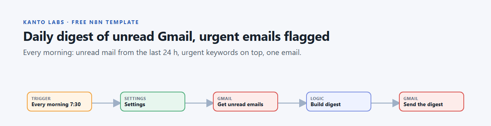
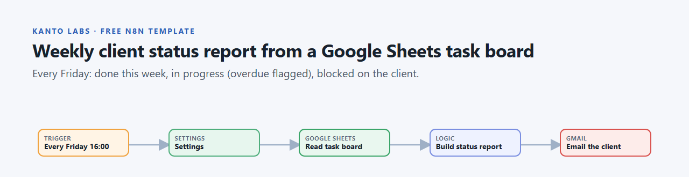
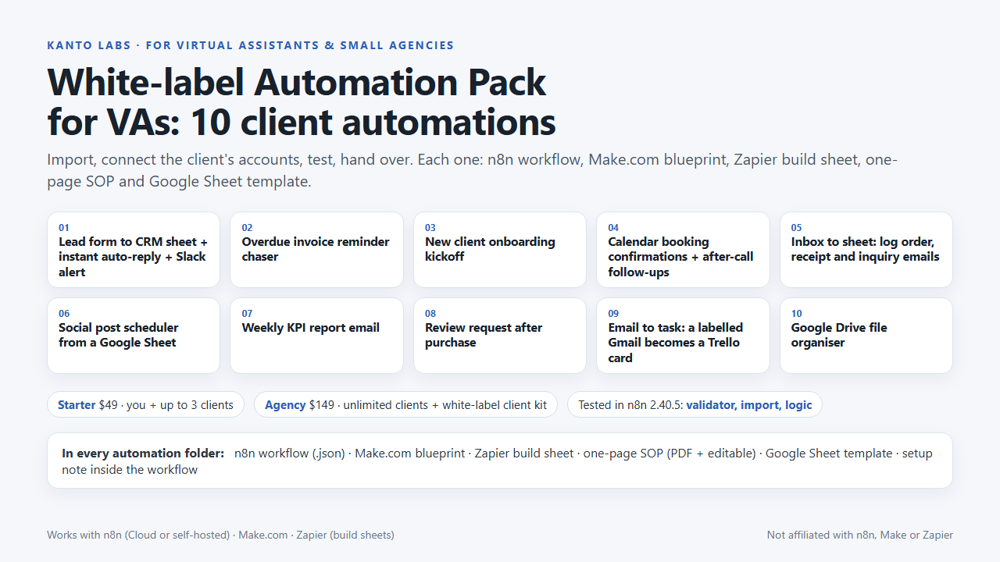
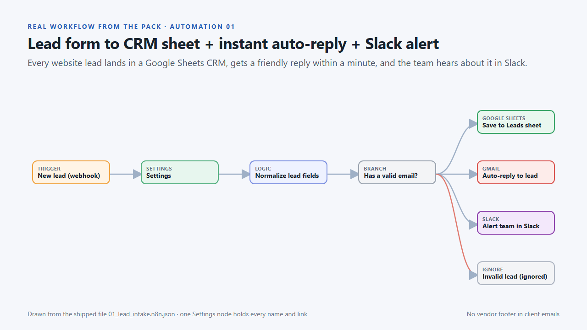

# Free n8n Templates for Virtual Assistants: Daily Gmail Digest + Weekly Client Status Report

Two free, ready-to-import **n8n workflow templates for virtual assistants (VAs), executive assistants,
freelancers and small agencies**. One sends a **daily digest of unread Gmail** with urgent emails at the
top; the other emails your client a **weekly status report from a Google Sheets task board**. Each takes
about 5 minutes to set up, and every name, recipient and keyword lives in one **Settings** node.

| template | trigger | uses |
|---|---|---|
| [Daily unread-email digest](daily_unread_email_digest/) | every day 7:30 | Gmail |
| [Weekly client status report](weekly_client_status_report/) | every Friday 16:00 | Google Sheets + Gmail |

**How they were tested:** both workflows pass n8n's own workflow validator on **n8n 2.40.5**, import
cleanly into a real n8n instance, and their Code-node logic was executed inside n8n with sample data.
They were **not** run against live Gmail or Google Sheets accounts, so run one test after you connect yours.

## 1. Daily digest of unread Gmail messages, urgent emails flagged

Every morning it collects the unread emails from the last 24 hours (default search: unread, newer than
1 day, no promotions/social), puts the ones containing your urgent keywords at the top, and sends
**one** HTML digest with a direct link to each email. Nothing is marked as read and nothing is deleted.
If nothing is unread, you get a short "nothing unread" note.

Good for: triaging a client's inbox, or an owner who wants a one-minute overview instead of dozens of
notifications. Duplicate it once per inbox you manage.

## 2. Weekly client status report from a Google Sheets task board

Every Friday afternoon it reads a `Tasks` tab (`Task`, `Client`, `Status`, `Priority`, `Owner`, `Due`,
`Completed On`, `Notes`) and emails the client a clean update: **completed this week**, **in progress**
(overdue items flagged in red) and **blocked, waiting on the client**. The subject line says how many tasks
were done and how many are waiting on them. One board can hold several clients (`clientFilter`).

## Quick start

1. Download the `.json` file from the template's folder.
2. In n8n: **Workflows -> Import from File** (or paste the JSON onto the canvas).
3. Connect your credentials in the Gmail / Google Sheets nodes.
4. Open the **Settings** node and fill in recipients, names and keywords.
5. Run it once by hand to test, then activate it.

Works on n8n Cloud or self-hosted n8n. Built and tested on n8n 2.40.5; older versions were not tested.
Full setup notes are in each template's README.

## FAQ

**Do I need to write code?**
No. You connect accounts and edit text in the Settings node. The logic sits in one small Code node you
don't have to touch.

**Are my credentials or data inside the files?**
No. The files contain no credentials, IDs or personal data. You connect your own accounts after import.

**Will my client see "sent by n8n"?**
No. The emails are sent without the n8n attribution footer, so they look like they come from you.

**Can I send the digest to Slack or Telegram instead?**
Yes: swap the last node for a Slack or Telegram node and pass it the same text.

**Can I use these with Make.com or Zapier?**
These two are n8n-only. (The paid pack below includes Make.com blueprints and Zapier build sheets.)

**Can I use them for paying clients?**
Yes. They are MIT-licensed: use, modify and share them, commercially too.

## Full version: White-label Automation Pack for VAs

These two templates are free samples from our **White-label Automation Pack for Virtual Assistants**:
**10 client automations** (lead intake with an instant auto-reply, overdue-invoice chaser, client onboarding,
booking follow-ups, inbox-to-sheet, social post scheduler, weekly KPI report, review requests, email-to-Trello,
Google Drive organiser). Each one comes as an n8n workflow, a Make.com blueprint, a Zapier build sheet, a
one-page SOP and a Google Sheet template, so you can install it for a client and sell it as your own service.

The pack's store page is being set up. Until it is live, see **[Kanto Labs services](https://kantolabs.pages.dev/services/)**,
where we also set up Zapier / Make / n8n automations for you.

---

Made by **Kanto Labs** - [kantolabs.pages.dev](https://kantolabs.pages.dev/). Not affiliated with n8n,
Make, Zapier or Google. Product names belong to their owners.
